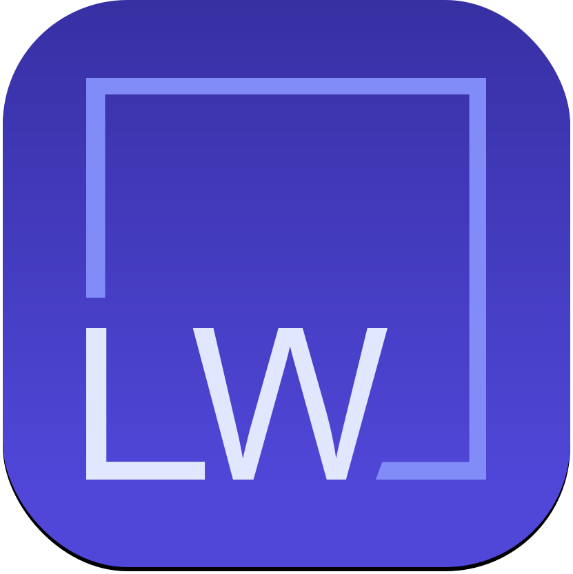
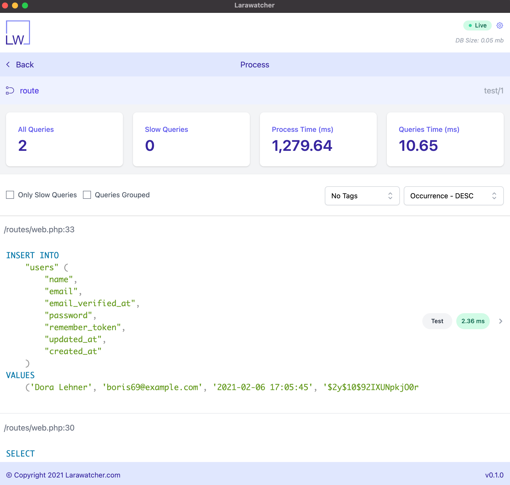

<div align="center">

<h1>Larawatcher</h1>
</div>

[](https://packagist.org/packages/larawatcher/larawatcher)
[](https://packagist.org/packages/larawatcher/larawatcher)
[](https://github.com/larawatcher/larawatcher/actions?query=workflow%3ATests+branch%3Amaster)
[](https://packagist.org/packages/larawatcher/larawatcher)

Larawatcher is a combination of Laravel Package and a stand alone desktop application that lets you profile database queries, find N+1 issues, backtrace to the code and more.

## Desktop Application

<div align="center">

</div>

Larawatcher comes with a stand-alone application that receives requests from your application, saves them and provides you with a dashboard to work with it.

You can download the latest version of the `Larawatcher Desktop` from https://github.com/larawatcher/desktop-builds/releases.

## Installation

You can install the package via composer:

```bash
composer require --dev larawatcher/larawatcher
```

You can publish the config file with:

```bash
php artisan vendor:publish --provider="Larawatcher\Providers\LarawatcherServiceProvider" --tag="config"
```

This is the contents of the published config file:

```php
return [
    /*
     * Use this setting if you want to disable/enable Larawatcher to listen for query execution
     */
    'enabled' => env('LARAWATCHER_ENABLED', true),
    /*
     * The `endpoint` will be used to send requests to Larawatcher desktop app.
     * `localhost` is good if you are using something like Laravel valet.
     * For Docker you may use `host.docker.internal` and for Laravel Homestead you may use `10.0.2.2`.
     */
    'endpoint' => env('LARAWATCHER_ENDPOINT', 'localhost'),
    /*
     * The `port` number used together with `endpoint` to send requests to Larawatcher desktop app.
     * The port should match the port you defined in Larawatcher desktop app (default 3000)
     */
    'port' => env('LARAWATCHER_PORT', 3000),
    /*
     * If you need Larawatcher to report queries wrapped between tags only, you may set `tags_only`
     * to `true`.
     */
    'tags_only' => env('LARAWATCHER_TAGS_ONLY', false),
    /**
     * If you need Larawatcher run `EXPLAIN` against the queries, set `explain` to `true`.
     */
    'explain' => env('LARAWATCHER_EXPLAIN', false),
    /**
     * In order to use `Open in editor` feature on desktop app and better backtrace, Larawatcher needs to know
     * where on your machine the code lives. If you are using Laravel valet, you may leave this blank and it will
     * figure it out, however in case of Docker or Laravel Homestead you need to be explicit about the path.
     */
    'app_path' => null,
    /**
     * This setting will be used to define the route groups that Larawatcher needs to watch for query execution.
     */
    'middleware_groups' => env('LARAWATCHER_MIDDLEWARE_GROUPS', ['web', 'api']),
];
```

## How does it work?

Larawatcher will listen to events related to `routes`, `commands` and `jobs` (including asynchronous ones), then it will watch the queries and communicate them back to the desktop app.
Please note the entry point to the application will invoke the watcher, and it won't be two separate processes (except the async jobs). For example: if you have a route that will run an artisan command and fire off a sync job, all queries will be captures in the `route` process.

## How to use tags?

To leverage the tag feature on Larawatcher, you may tag and untag part of your code using the Larawatcher facade or the helper functions.
Facade Example::

```php
Larawatcher::tag('load-users');

$users = User::all();

Larawatcher::untag('load-users');
```

Helper functions example:

```php
lw_tag('load-users');

$users = User::all();

lw_untag('load-users');
```

## Testing

```bash
composer test
```

## Changelog

Please see [CHANGELOG](CHANGELOG.md) for more information on what has changed recently.

## Contributing

Please see [CONTRIBUTING](CONTRIBUTING.md) for details.

## Security

If you discover any security related issues, please email hs@houmaan.ca instead of using the issue tracker.

## Credits

-   [Hugh Saffar](https://github.com/hughsaffar)
-   [All Contributors](../../contributors)

## License

The MIT License (MIT). Please see [License File](LICENSE.md) for more information.
